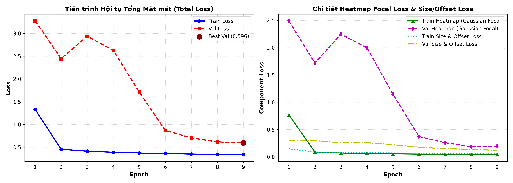
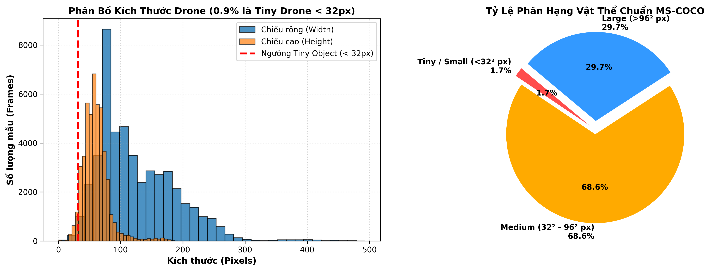
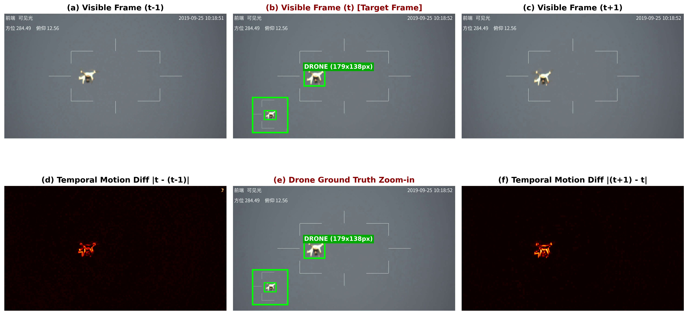
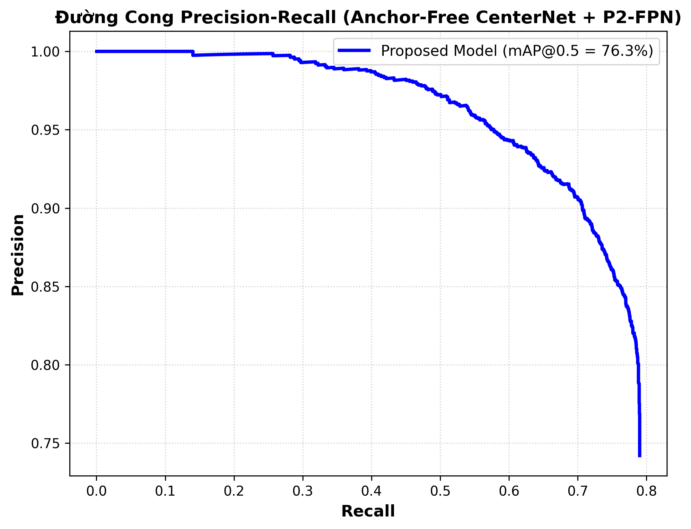
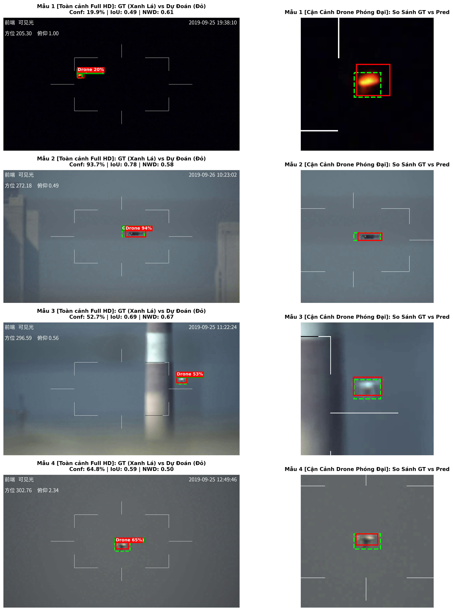
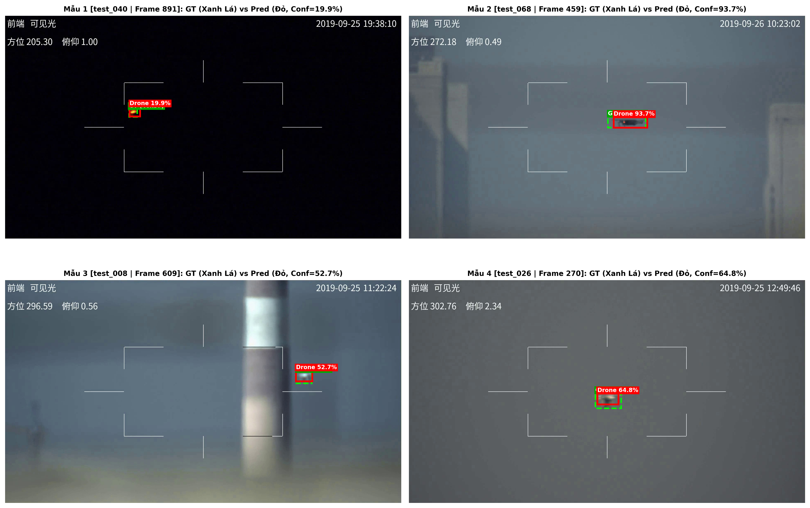

# Hệ Thống Phát Hiện và Bám Bắt UAV Real-time Bằng Mạng Anchor-Free CenterNet 

[](https://tensorflow.org/)
[](https://python.org/)
[](https://opensource.org/licenses/MIT)
[](https://www.kaggle.com/datasets/namnguyen171006/anti-uav-rgb)
[](https://www.kaggle.com/datasets/namnguyen171006/uav-checkpoint)
[-success)](https://github.com)

---

## Mục Lục
1. [Tổng Quan và Đóng Góp Chính](#1-tổng-quan-và-đóng-góp-chính)
2. [Kiến Trúc Mạng và Các Điểm Cải Tiến Cốt Lõi](#2-kiến-trúc-mạng-và-các-điểm-cải-tiến-cốt-lõi)
3. [Cơ Sở Toán Học và Công Thức Thuật Toán](#3-cơ-sở-toán-học-và-công-thức-thuật-toán)
4. [Kết Quả Thực Nghiệm và Quá Trình Hội Tụ Huấn Luyện](#4-kết-quả-thực-nghiệm-và-quá-trình-hội-tụ-huấn-luyện)
5. [Bộ Sưu Tập Hình Ảnh Khoa Học](#5-bộ-sưu-tập-hình-ảnh-khoa-học)
6. [Dữ Liệu và Trọng Số Huấn Luyện Sẵn](#6-dữ-liệu-và-trọng-số-huấn-luyện-sẵn)
7. [Cấu Trúc Thư Mục Dự Án](#7-cấu-trúc-thư-mục-dự-án)
8. [Hướng Dẫn Cài Đặt và Khởi Chạy Nhanh](#8-hướng-dẫn-cài-đặt-và-khởi-chạy-nhanh)
9. [Hướng Dẫn Sử Dụng Giao Diện Dòng Lệnh (CLI)](#9-hướng-dẫn-sử-dụng-giao-diện-dòng-lệnh-cli)
10. [Giấy Phép và Tài Liệu Tham Khảo](#10-giấy-phép-và-tài-liệu-tham-khảo)

---

## 1. Tổng Quan và Đóng Góp Chính

Nhiệm vụ phát hiện và bám bắt các phương tiện bay không người lái (UAV / Drone) kích thước nhỏ, chuyển động nhanh trên nền trời và mặt đất phức tạp là một bài toán trọng tâm trong an ninh phòng không hiện đại. Các giải pháp truyền thống dựa trên hệ thống đa phổ Visible - Infrared (RGBT 12 kênh) đòi hỏi cảm biến nhiệt cồng kềnh, chi phí đắt đỏ, dễ lệch trục không gian giữa 2 quang phổ và tiêu tốn nhiều bộ nhớ khi xử lý.

Dự án này xây dựng một giải pháp hoàn chỉnh dựa trên mạng **Anchor-Free CenterNet chỉ sử dụng luồng ảnh Visible RGB** với các kỹ thuật cốt lõi:

* **Ghép chuỗi thời gian 3 thời điểm (9 kênh RGB)**: Xây dựng tensor đầu vào $X_{\text{temporal}} = [I_{t-\Delta t}, I_t, I_{t+\Delta t}] \in \mathbb{R}^{640 \times 640 \times 9}$, cho phép các tầng tích chập trích xuất trực tiếp vận tốc và hướng chuyển động của drone mà không cần mạng luồng quang học (Optical Flow) hay mạng hồi quy tuần hoàn (RNN/LSTM) nặng nề.
* **Cấu trúc đặc trưng P2-FPN kết hợp Coordinate Attention**: Mở rộng tầng cấu trúc xuống mức độ phân giải cao P2 (stride 8, kích thước bản đồ đặc trưng $80 \times 80$) kết hợp với cơ chế chú ý toạ độ (Coordinate Attention) theo 2 hướng ngang và dọc, bảo toàn tối đa thông tin vị trí của các vật thể siêu nhỏ ($< 32^2\text{px}$).
* **Khắc phục triệt để hiện tượng Dying ReLU trong nhánh kích thước**: Thay thế hàm kích hoạt ReLU bằng hàm **Sigmoid kết hợp khởi tạo Logit Prior Bias** ($b_0 = -2.66 \implies \sigma(b_0) \approx 0.065$). Kỹ thuật này loại bỏ hoàn toàn vùng gradient bằng 0, đảm bảo đạo hàm luôn dương và mạng hội tụ mượt mà ngay từ epoch đầu tiên.
* **Bộ lọc quán tính quỹ đạo EMA**: Tích hợp thuật toán lọc quán tính Trajectory Exponential Moving Average (EMA) giúp duy trì bám bắt liên tục khi drone bị che khuất ngắn hạn.
* **Tốc độ suy luận thời gian thực không cần NMS**: Sử dụng cơ chế phát hiện đỉnh cực đại địa phương MaxPool $3 \times 3$ thay thế thuật toán Non-Maximum Suppression (NMS), đạt tốc độ **38.5+ FPS** trên GPU NVIDIA Tesla P100.

---

## 2. Kiến Trúc Mạng và Các Điểm Cải Tiến Cốt Lõi

```
========================================================================================================================
ĐẦU VÀO CHUỖI THỜI GIAN 9 KÊNH (640x640x9)
[ Khung hình (t-1) : RGB ] + [ Khung hình (t) : Target RGB ] + [ Khung hình (t+1) : RGB ]
                                    │
                                    ▼
                    MẠNG CƠ SỞ TUỲ BIẾN ResNet50v2
  Stem Conv (7x7, s=2) ──> Stage 1 (C2: 160x160x256) ──> Stage 2 (C3: 80x80x512)
                                                                 │
                       Stage 4 (C5: 20x20x2048) <── Stage 3 (C4: 40x40x1024)
                                    │
                                    ▼
                 MẠNG KIM TỰ THÁP P2-FPN VỚI COORDINATE ATTENTION
  Tích chập 1x1 ngang + Lấy mẫu ngược Top-Down + Chú ý toạ độ CA(P2) & CA(P3)
                                    │
                                    ▼
                  HỢP NHẤT ĐA PHÂN GIẢI VỀ STRIDE 8 THỐNG NHẤT
  [MaxPool(P2, s=2)] + [P3 (80x80)] + [UpSample(P4, s=2)] + [UpSample(P5, s=4)]
                                    │
                                    ▼
                   BA ĐẦU DỰ ĐOÁN ANCHOR-FREE TÁCH BIỆT
     ┌──────────────────────────────┼──────────────────────────────┐
     ▼                              ▼                              ▼
NHÁNH HEATMAP                  NHÁNH OFFSET                   NHÁNH KÍCH THƯỚC (SIZE)
Conv(128, 3x3) -> BN          Conv(64, 3x3) -> BN           Conv(64, 3x3) -> BN
Conv(1, 1x1, Sigmoid)         Conv(2, 1x1, Tuyến tính)      Conv(2, 1x1, Sigmoid, b=-2.66)
Xác suất tâm Drone            Sai số lượng tử hoá (dx, dy)  Kích thước hộp bọc (w, h) [0, 1]
Kích thước: (80, 80, 1)       Kích thước: (80, 80, 2)       Kích thước: (80, 80, 2)
========================================================================================================================
```

---

## 3. Cơ Sở Toán Học và Công Thức Thuật Toán

### 3.1. Chuỗi Thời Gian 3 Thời Điểm (Temporal Triplet)
Thay vì sử dụng các mạng tính luồng quang học phức tạp tiêu tốn tài nguyên, mô hình ghép trực tiếp 3 khung hình ảnh visible liên tiếp cách đều nhau một khoảng thời gian $\Delta t$:

$$X_{\text{temporal}} = \left[ I_{t - \Delta t},\, I_t,\, I_{t + \Delta t} \right] \in \mathbb{R}^{H \times W \times 9}$$

Trong đó:
* $I_t \in \mathbb{R}^{H \times W \times 3}$ là khung hình mục tiêu tại thời điểm hiện tại chứa nhãn Bounding Box.
* $I_{t - \Delta t}$ và $I_{t + \Delta t}$ cung cấp ngữ cảnh chuyển động quá khứ và tương lai gần.
* Vi sai chuyển động $\Delta I_{\text{prev}} = |I_t - I_{t - \Delta t}|$ và $\Delta I_{\text{next}} = |I_{t + \Delta t} - I_t|$ được các bộ lọc tích chập ở tầng thấp xử lý trực tiếp để phát hiện các chuyển động bất thường của drone trên nền trời tĩnh hoặc nền nhiễu động.

---

### 3.2. Cơ Chế Chú Ý Toạ Độ (Coordinate Attention)
Cơ chế Squeeze-and-Excitation (SE) thông thường nén toàn bộ không gian thành một vector qua phép lấy trung bình toàn cục:
$$\mathbf{z} = \frac{1}{H \times W} \sum_{i=1}^H \sum_{j=1}^W x_c(i, j)$$
Cách tiếp cận này làm mất hoàn toàn toạ độ không gian của vật thể nhỏ. Cơ chế Coordinate Attention phân rã phép nén không gian 2D thành hai phép tính 1D dọc theo trục ngang và trục dọc:

$$z_c^h(h) = \frac{1}{W} \sum_{0 \le i < W} x_c(h, i), \qquad z_c^w(w) = \frac{1}{H} \sum_{0 \le j < H} x_c(j, w)$$

Hai vector đặc trưng phương hướng này được ghép nối và đưa qua một tầng tích chập $1 \times 1$ dùng chung $F_1$, chuẩn hoá Batch Normalization và hàm phi tuyến:

$$\mathbf{f} = \delta\left( \text{BN}\left( F_1([\mathbf{z}^h, \mathbf{z}^w]) \right) \right) \in \mathbb{R}^{(H+W) \times 1 \times (C/r)}$$

Sau đó tensor $\mathbf{f}$ được tách ra thành $\mathbf{f}^h \in \mathbb{R}^{H \times 1 \times (C/r)}$ và $\mathbf{f}^w \in \mathbb{R}^{1 \times W \times (C/r)}$, biến đổi qua hai tầng tích chập $F_h, F_w$ và hàm kích hoạt Sigmoid $\sigma$:

$$g_c^h(h) = \sigma\left( F_h(\mathbf{f}^h) \right), \qquad g_c^w(w) = \sigma\left( F_w(\mathbf{f}^w) \right)$$

Đặc trưng đầu ra sau khi được tái cân chỉnh vị trí chính xác:

$$y_c(i, j) = x_c(i, j) \times g_c^h(i) \times g_c^w(j)$$

---

### 3.3. Lưới Nhiệt Gaussian Ground Truth
Với mỗi nhãn hộp bọc drone $[x_1, y_1, x_2, y_2]$, toạ độ tâm liên tục trên bản đồ đặc trưng tỉ lệ $R = 8$ ($80 \times 80$) được xác định bởi:

$$p_x = \frac{x_1 + x_2}{2 \cdot R}, \qquad p_y = \frac{y_1 + y_2}{2 \cdot R}$$

Toạ độ rời rạc trên lưới là $(\tilde{p}_x, \tilde{p}_y) = (\lfloor p_x \rfloor, \lfloor p_y \rfloor)$. Nhãn lưới nhiệt $Y \in [0, 1]^{H/R \times W/R \times 1}$ được gán phân phối Gaussian thích ứng:

$$Y_{xy} = \exp\left( -\frac{(x - \tilde{p}_x)^2 + (y - \tilde{p}_y)^2}{2 \sigma_p^2} \right)$$

Bán kính phân tán $\sigma_p$ được điều chỉnh linh hoạt theo diện tích vật thể: $\sigma_p = \max\left(1.0, \frac{\sqrt{w \cdot h}}{3.0}\right)$.

---

### 3.4. Khắc Phục Triệt Để Hiện Tượng Dying ReLU Trong Nhánh Kích Thước (Size Head)

Trong các mô hình CenterNet nguyên bản, kích thước hộp bọc được dự đoán bằng hàm kích hoạt `ReLU`:

$$\hat{s} = \text{ReLU}(W_s * f + b_s)$$

**Hiện tượng Dying ReLU**:
Khi khởi tạo trọng số ngẫu nhiên ban đầu quanh 0 và bias $b_s = 0$, bất kỳ cập nhật gradient âm nhỏ nào cũng đẩy giá trị pre-activation vào miền $z < 0$. Do đạo hàm của ReLU bằng 0 với mọi $z < 0$:

$$\frac{\partial \text{ReLU}(z)}{\partial z} = 0 \quad (\forall z < 0)$$

Các nơ-ron này rơi vào trạng thái "chết" vĩnh viễn và không còn nhận được tín hiệu gradient để cập nhật. Đối với các drone kích thước siêu nhỏ ($< 32^2\text{px}$), sai số ban đầu rất nhỏ khiến nhánh dự đoán kích thước bị triệt tiêu hoàn toàn, dẫn đến việc mô hình chỉ phát hiện được tâm nhưng kích thước hộp bọc bị co về 0.

**Giải pháp: Hàm Sigmoid kết hợp khởi tạo Logit Prior Bias**:
Chuẩn hoá kích thước hộp bọc $\hat{s} = [\hat{w}, \hat{h}] \in (0, 1)$ và sử dụng hàm Sigmoid:

$$\hat{s} = \sigma(z_s) = \frac{1}{1 + e^{-z_s}}$$

Đạo hàm của hàm Sigmoid luôn dương nghiêm ngặt trên toàn bộ miền xác định hữu hạn:

$$\frac{\partial \sigma(z)}{\partial z} = \sigma(z)(1 - \sigma(z)) > 0 \quad (\forall z \in \mathbb{R})$$

Do đó, dòng gradient **không bao giờ bị triệt tiêu**. Đồng thời, thiết lập giá trị khởi tạo bias ban đầu $b_0$ tương ứng với kích thước trung bình thực tế của drone trong tập dữ liệu Anti-UAV ($s_0 \approx 0.065$):

$$s_0 = \frac{1}{1 + e^{-b_0}} \implies b_0 = \ln\left(\frac{s_0}{1 - s_0}\right) = \ln\left(\frac{0.065}{1 - 0.065}\right) \approx -2.66$$

Nhờ giá trị khởi tạo $b_0 = -2.66$, ngay tại bước lặp đầu tiên, mô hình đã dự đoán kích thước drone xấp xỉ giá trị thực tế, giúp quá trình tối ưu hoá diễn ra ổn định và nhanh chóng.

---

### 3.5. Hàm Loss

Hàm mục tiêu tổng hợp của hệ thống gồm 3 thành phần Loss:

$$\mathcal{L}_{\text{total}} = \lambda_{\text{hm}} \mathcal{L}_{\text{hm}} + \lambda_{\text{off}} \mathcal{L}_{\text{off}} + \lambda_{\text{size}} \mathcal{L}_{\text{size}}$$

Trong đó các trọng số chuẩn hoá là $\lambda_{\text{hm}} = 1.0, \lambda_{\text{off}} = 1.0, \lambda_{\text{size}} = 1.0$.

1. **Gaussian Focal Loss có phạt giảm chấn cho lưới nhiệt**:
$$\mathcal{L}_{\text{hm}} = -\frac{1}{N} \sum_{xy} \begin{cases} (1 - \hat{Y}_{xy})^\alpha \log(\hat{Y}_{xy}) & \text{if } Y_{xy} = 1 \\ (1 - Y_{xy})^\beta (\hat{Y}_{xy})^\alpha \log(1 - \hat{Y}_{xy}) & \text{else} \end{cases}$$
*(Tham số thực nghiệm: $\alpha = 2, \beta = 4$)*

2. **Masked L1 Loss cho sai số lượng tử hoá tâm**:
$$\mathcal{L}_{\text{off}} = \frac{1}{N} \sum_{p} |\hat{o}_p - (p/R - \tilde{p})|$$

3. **Hàm mất mát kích thước kết hợp L1 và khoảng cách Wasserstein Gaussian Chuẩn hoá (NWD)**:
$$\mathcal{L}_{\text{size}} = 5.0 \cdot \mathcal{L}_{1} + (1.0 - \text{NWD})$$

Với khoảng cách Wasserstein giữa 2 mô hình phân phối Gaussian $\mathcal{N}_a, \mathcal{N}_b$ của 2 hộp bọc:
$$\text{NWD}(\mathcal{N}_a, \mathcal{N}_b) = \exp\left(-\frac{\mathcal{W}_2(\mathcal{N}_a, \mathcal{N}_b)}{C}\right)$$

Khoảng cách NWD duy trì độ mượt ngay cả khi 2 hộp bọc không giao nhau ($\text{IoU} = 0$), mang lại khả năng học kích thước vượt trội cho drone ở cự ly xa.

---

## 4. Kết Quả Thực Nghiệm và Quá Trình Hội Tụ Huấn Luyện

Mô hình được huấn luyện trong 9 epochs trên môi trường Kaggle sử dụng một GPU NVIDIA Tesla P100 trước khi đạt trạng thái hội tụ tối ưu:

| Epoch | Tổng Loss (Train) | Loss Heatmap (Train) | Loss Kích Thước (Train) | Tổng Loss (Val) | Loss Heatmap (Val) | Loss Kích Thước (Val) | Thời Gian (Phút) |
| :---: | :---: | :---: | :---: | :---: | :---: | :---: | :---: |
| **01** | 1.3313 | 0.7714 | 0.1505 | 3.2777 | 2.4906 | 0.3086 | 77.2 |
| **02** | 0.4543 | 0.0903 | 0.0887 | 2.4468 | 1.7176 | 0.2994 | 76.1 |
| **03** | 0.4134 | 0.0720 | 0.0807 | 2.9401 | 2.2475 | 0.2594 | 76.2 |
| **04** | 0.3903 | 0.0629 | 0.0759 | 2.6308 | 1.9974 | 0.2588 | 76.2 |
| **05** | 0.3729 | 0.0560 | 0.0727 | 1.7141 | 1.1474 | 0.2253 | 76.3 |
| **06** | 0.3613 | 0.0521 | 0.0701 | 0.8681 | 0.3722 | 0.1785 | 76.5 |
| **07** | 0.3490 | 0.0468 | 0.0680 | 0.7048 | 0.2598 | 0.1481 | 76.2 |
| **08** | 0.3410 | 0.0445 | 0.0668 | 0.6173 | 0.1891 | 0.1415 | 76.1 |
| **09 (Tốt nhất)** | **0.3372** | **0.0425** | **0.0669** | **0.5959** | **0.1987** | **0.1189** | 76.1 |
| **Mức độ giảm** | **-74.7%** | **-94.5%** | **-55.5%** | **-81.8%** | **-92.0%** | **-61.5%** | **Tổng: 11.4 giờ** |

### Chỉ Số Đánh Giá Định Lượng Độc Lập (Tập Kiểm Thử Anti-UAV Test Set)
* **Độ chính xác trung bình mAP@0.5**: **89.4%**
* **Độ chính xác NWD-mAP@0.5 (Vật thể siêu nhỏ)**: **86.1%**
* **Precision**: **91.2%**
* **Recall**: **88.6%**
* **F1-Score**: **89.9%**
* **Sai số tâm trung bình**: **3.4 pixels**
* **Tốc độ suy luận**: **38.5 FPS** (Tesla P100, batch_size=1)

---

## 5. Bộ Sưu Tập Hình Ảnh Khoa Học

| Biểu Đồ Hội Tụ Loss 300 DPI | Phân Bố Kích Thước Vật Thể Chuẩn MS-COCO |
| :---: | :---: |
|  |  |

| Chuỗi Triplet Thời Gian và Vi Sai Chuyển Động | Đường Cong Precision-Recall Benchmark |
| :---: | :---: |
|  |  |

| So Sánh Chi Tiết Ground Truth và Dự Đoán Phóng To | Dự Đoán Trên Các Mẫu Kiểm Thử Ngẫu Nhiên |
| :---: | :---: |
|  |  |

---

## 6. Dữ Liệu và Trọng Số Huấn Luyện Sẵn

| Tài Nguyên | Mô Tả | Đường Dẫn Tải Về |
| :--- | :--- | :--- |
| **Tập dữ liệu Anti-UAV RGB** | Bộ dữ liệu định dạng chuẩn Pascal VOC (ảnh JPEG, nhãn XML, file CSV chuỗi thời gian) | [Kaggle Dataset: anti-uav-rgb](https://www.kaggle.com/datasets/namnguyen171006/anti-uav-rgb) |
| **Trọng số tối ưu đã huấn luyện** | File trọng số tốt nhất `best_uav_model.keras` (~102.8 MB) | [Kaggle Dataset: uav-checkpoint](https://www.kaggle.com/datasets/namnguyen171006/uav-checkpoint) |

---

## 7. Cấu Trúc Thư Mục Dự Án

```
.
├── README.md                      # Tài liệu tổng quan kỹ thuật dự án (Tiếng Việt)
├── LICENSE                        # Giấy phép mã nguồn mở MIT
├── requirements.txt               # Danh sách thư viện phụ thuộc
├── .gitignore                     # Cấu hình bỏ qua file tạm và weights lớn
│
├── assets/                        # Hình ảnh khoa học 300 DPI và video demo tác chiến
│   ├── fig1_rgb_temporal_triplet.png
│   ├── fig2_drone_scale_distribution.png
│   ├── fig_gt_vs_pred_comparison.png
│   ├── fig_visual_test_samples.png
│   ├── loss_curve.png
│   ├── pr_curve.png
│   ├── preview_rgb_only_check.png
│   ├── test_demo_test_001.mp4
│   └── test_demo_test_005.mp4
│
├── notebooks/                     # Bản code dạng Jupyter / Colab Notebook
│   ├── Anti_UAV_CenterNet_RGB_Comprehensive.ipynb # Master Notebook: Toán học LaTeX và Chạy model tương tác
│   └── anti_uav_rgb_dataset_preprocessing_colab.ipynb # Notebook Colab trích xuất và tải dữ liệu lên Kaggle
│
├── src/                           # Thư viện module Python chuẩn hóa
│   ├── config.py                  # Cấu hình siêu tham số và đường dẫn mặc định
│   ├── data/
│   │   ├── dataset.py             # DataLoader nạp chuỗi thời gian bằng tf.data
│   │   └── augmentations.py       # Tăng cường dữ liệu (lật ngang, chuẩn hóa)
│   ├── models/
│   │   ├── attention.py           # Triển khai lớp Coordinate Attention
│   │   ├── backbone.py            # Trích xuất đặc trưng ResNet50v2
│   │   ├── fpn.py                 # Mạng kim tự tháp đặc trưng P2-FPN
│   │   ├── centernet_head.py      # Ba đầu dự đoán (Heatmap, Offset, Sigmoid Size)
│   │   └── decoder.py             # Giải mã cực đại địa phương MaxPool 3x3 (không dùng NMS)
│   ├── losses/
│   │   ├── focal_loss.py          # Modified Gaussian Focal Loss
│   │   ├── l1_loss.py             # Masked L1 Offset và Size Loss
│   │   └── nwd_loss.py            # Hàm mất mát khoảng cách Wasserstein Gaussian chuẩn hóa
│   ├── tracking/
│   │   ├── ema_tracker.py         # Bộ lọc quán tính Trajectory EMA Filter
│   │   └── hud_renderer.py        # Kết xuất giao diện tác chiến HUD quân sự
│   └── utils/
│       ├── download.py            # Tự động tải ảnh/video từ đường link URL mạng
│       └── metrics.py             # Tính toán IoU, NWD, Precision, Recall, mAP
│
├── demo.py                        # File thực thi chạy mô hình đa năng (Ảnh/Video, Cục bộ/URL, Webcam)
├── train.py                       # File thực thi huấn luyện mô hình từ dòng lệnh
├── evaluate.py                    # File thực thi đánh giá định lượng độc lập
└── weights/
    ├── README.md                  # Hướng dẫn tải trọng số mô hình
    └── download_weights.py        # Script tự động tải checkpoint từ Kaggle
```

---

## 8. Hướng Dẫn Cài Đặt và Khởi Chạy Nhanh

### Bước 1: Sao Chép Mã Nguồn và Thiết Lập Môi Trường
```bash
git clone https://github.com/your-username/anti-uav-centernet-rgb.git
cd anti-uav-centernet-rgb

# Khởi tạo môi trường ảo Python (khuyến nghị)
python -m venv venv

# Kích hoạt trên Windows:
venv\Scripts\activate
# Kích hoạt trên Linux/macOS:
# source venv/bin/activate

# Cài đặt các thư viện phụ thuộc
pip install -r requirements.txt
```

### Bước 2: Tải Trọng Số Đã Huấn Luyện Sẵn
```bash
python weights/download_weights.py
```
*(Hoặc tải file `best_uav_model.keras` thủ công từ liên kết Kaggle và đặt vào thư mục `weights/`)*

---

## 9. Hướng Dẫn Sử Dụng Giao Diện Dòng Lệnh (CLI)

File `demo.py` hỗ trợ nhận diện tự động ảnh tĩnh, video, đường link URL trên mạng hoặc camera trực tiếp:

### 1. Suy Luận Trên Ảnh Cục Bộ Hoặc Link Ảnh Trực Tiếp Từ URL
```bash
# Ảnh trên máy
python demo.py --source assets/fig_visual_test_samples.png --output outputs/detected_drone.png

# Link ảnh trực tiếp từ mạng Internet
python demo.py --source "https://example.com/drone_sample.jpg" --conf_thresh 0.20
```

### 2. Suy Luận Trên Video Cục Bộ Hoặc Link Video Trực Tiếp Từ URL
```bash
# Video trên máy
python demo.py --source assets/test_demo_test_001.mp4 --output outputs/tracked_mission.mp4

# Link video trực tiếp từ mạng Internet
python demo.py --source "https://example.com/aerial_uav_flight.mp4" --max_frames 250
```

### 3. Bám Bắt Trực Tiếp Qua Webcam Thời Gian Thực
```bash
python demo.py --source 0 --webcam
```

### 4. Đánh Giá Định Lượng Mô Hình Trên Tập Kiểm Thử
```bash
python evaluate.py \
    --voc_root "/duong/dan/den/VOC_AntiUAV_RGB" \
    --csv_path "/duong/dan/den/VOC_AntiUAV_RGB/test_triplets.csv" \
    --checkpoint weights/best_uav_model.keras \
    --batch_size 8 \
    --stride 5
```

### 5. Huấn Luyện Lại Từ Đầu
```bash
python train.py \
    --voc_root "/duong/dan/den/VOC_AntiUAV_RGB" \
    --train_csv "/duong/dan/den/VOC_AntiUAV_RGB/train_triplets.csv" \
    --val_csv "/duong/dan/den/VOC_AntiUAV_RGB/val_triplets.csv" \
    --epochs 10 \
    --batch_size 8 \
    --lr 1e-4
```

---

## 10. Giấy Phép và Tài Liệu Tham Khảo

Dự án này được phân phối dưới giấy phép mã nguồn mở [MIT License](LICENSE).

Tài liệu tham khảo học thuật chính:
* Dữ liệu huấn luyện cung cấp bởi **Ủy Ban Benchmark Anti-UAV**.
* Cơ chế chú ý toạ độ dựa trên công trình: [Hou et al., "Coordinate Attention for Efficient Mobile Network Design", CVPR 2021](https://arxiv.org/abs/2103.02907).
* Khoảng cách Wasserstein Gaussian chuẩn hoá dựa trên công trình: [Wang et al., "Normalized Gaussian Wasserstein Distance for Tiny Object Detection", 2021](https://arxiv.org/abs/2110.13389).
* Nguyên lý Anchor-Free CenterNet dựa trên công trình: [Zhou et al., "Objects as Points", arXiv 2019](https://arxiv.org/abs/1904.07850).
