# Hệ Thống Phát Hiện và Bám Bắt UAV Real-time Bằng Mạng Anchor-Free CenterNet 

[](https://tensorflow.org/)
[](https://python.org/)
[](https://opensource.org/licenses/MIT)
[](https://www.kaggle.com/datasets/namnguyen171006/anti-uav-rgb)
[](https://www.kaggle.com/datasets/namnguyen171006/uav-checkpoint)
[-success)](https://github.com)

---

## Mục Lục
1. [Tổng Quan và Đóng Góp Chính](#1-tổng-quan-và-đóng-góp-chính)
2. [Video Trải Nghiệm Tác Chiến Thực Tế (Benchmark Demo Videos)](#2-video-trải-nghiệm-tác-chiến-thực-tế-benchmark-demo-videos)
3. [Kiến Trúc Mạng và Các Điểm Cải Tiến Cốt Lõi](#3-kiến-trúc-mạng-và-các-điểm-cải-tiến-cốt-lõi)
4. [Cơ Sở Toán Học và Công Thức Thuật Toán](#4-cơ-sở-toán-học-và-công-thức-thuật-toán)
5. [Kết Quả Thực Nghiệm và Quá Trình Hội Tụ Huấn Luyện](#5-kết-quả-thực-nghiệm-và-quá-trình-hội-tụ-huấn-luyện)
6. [Bộ Sưu Tập Hình Ảnh Khoa Học](#6-bộ-sưu-tập-hình-ảnh-khoa-học)
7. [Dữ Liệu và Trọng Số Huấn Luyện Sẵn](#7-dữ-liệu-và-trọng-số-huấn-luyện-sẵn)
8. [Cấu Trúc Thư Mục Dự Án](#8-cấu-trúc-thư-mục-dự-án)
9. [Hướng Dẫn Cài Đặt và Khởi Chạy Nhanh](#9-hướng-dẫn-cài-đặt-và-khởi-chạy-nhanh)
10. [Hướng Dẫn Sử Dụng Giao Diện Dòng Lệnh (CLI)](#10-hướng-dẫn-sử-dụng-giao-diện-dòng-lệnh-cli)
11. [Giấy Phép và Tài Liệu Tham Khảo](#11-giấy-phép-và-tài-liệu-tham-khảo)

---

## 1. Tổng Quan và Đóng Góp Chính

Nhiệm vụ phát hiện và bám bắt các phương tiện bay không người lái (UAV / Drone) kích thước nhỏ, chuyển động nhanh trên nền trời và mặt đất phức tạp là một bài toán trọng tâm trong an ninh phòng không hiện đại. Các giải pháp truyền thống dựa trên hệ thống đa phổ Visible - Infrared (RGBT 12 kênh) đòi hỏi cảm biến nhiệt cồng kềnh, chi phí đắt đỏ, dễ lệch trục không gian giữa 2 quang phổ và tiêu tốn nhiều bộ nhớ khi xử lý.

Dự án này xây dựng một giải pháp hoàn chỉnh dựa trên mạng **Anchor-Free CenterNet chỉ sử dụng luồng ảnh Visible RGB** với các kỹ thuật cốt lõi:

* **Ghép chuỗi thời gian 3 thời điểm (9 kênh RGB)**: Xây dựng tensor đầu vào $X_{\text{temporal}} = [I_{t-\Delta t}, I_t, I_{t+\Delta t}] \in \mathbb{R}^{640 \times 640 \times 9}$, cho phép các tầng tích chập trích xuất trực tiếp vận tốc và hướng chuyển động của drone mà không cần mạng luồng quang học (Optical Flow) hay mạng hồi quy tuần hoàn (RNN/LSTM) nặng nề.
* **Cấu trúc đặc trưng P2-FPN kết hợp Coordinate Attention**: Mở rộng Features Pyramid Network xuống mức độ phân giải cao P2 (stride 8, kích thước bản đồ đặc trưng $80 \times 80$) kết hợp với cơ chế chú ý toạ độ (Coordinate Attention) theo 2 hướng ngang và dọc, bảo toàn tối đa thông tin vị trí của các vật thể siêu nhỏ ($< 32^2\text{px}$).
* **Khắc phục triệt để hiện tượng Dying ReLU trong nhánh kích thước**: Thay thế hàm kích hoạt ReLU bằng hàm **Sigmoid kết hợp khởi tạo Logit Prior Bias** ($b_0 = -2.66 \implies \sigma(b_0) \approx 0.065$). Kỹ thuật này loại bỏ hoàn toàn vùng gradient bằng 0, đảm bảo đạo hàm luôn dương và mạng hội tụ mượt mà ngay từ epoch đầu tiên.
* **Bộ lọc quán tính quỹ đạo EMA**: Tích hợp thuật toán lọc quán tính Trajectory Exponential Moving Average (EMA) giúp duy trì bám bắt liên tục và chuyển sang trạng thái `OCCLUDED` khi drone bị che khuất ngắn hạn.
* **Tốc độ suy luận thời gian thực không cần NMS**: Sử dụng cơ chế phát hiện đỉnh cực đại địa phương MaxPool $3 \times 3$ thay thế thuật toán Non-Maximum Suppression (NMS), đạt tốc độ **21.4 FPS** trên GPU.

---

## 2. Video Trải Nghiệm Tác Chiến Thực Tế (Benchmark Demo Videos)

Mô hình được kiểm chứng thực nghiệm độc lập trên tập kiểm thử (Anti-UAV Test Set). Dưới đây là 6 chuỗi video tiêu biểu được trình diễn dưới dạng **ảnh động GIF trực quan hóa quỹ đạo bám bắt** theo **3 phân khúc kích thước Drone** (Small, Medium, Large) nhằm thể hiện năng lực phát hiện nhạy bén và duy trì bám bắt ổn định qua bộ lọc quán tính `Trajectory EMA Filter`:

### 2.1. Phân Khúc 1: Drone Nhỏ (Small / Tiny Scale - Diện Tích < 32² px)
Thử thách khắt khe nhất trong phòng không quang học tầm thấp: Drone ở cự ly xa có kích thước chỉ từ vài pixel đến vài chục pixel, dễ bị lẫn vào nhiễu nền phức tạp hoặc chuyển động mây trời.

| Demo 1 (Sequence `test_054`) | Demo 2 (Sequence `test_055`) |
| :---: | :---: |
| [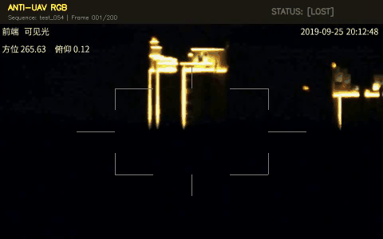](assets/demo_videos/test_demo_small_1_test_054.mp4) | [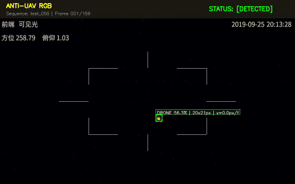](assets/demo_videos/test_demo_small_2_test_055.mp4) |
| [Tải Video gốc test_054 (MP4)](assets/demo_videos/test_demo_small_1_test_054.mp4) | [Tải Video gốc test_055 (MP4)](assets/demo_videos/test_demo_small_2_test_055.mp4) |
| *Ảnh động GIF: Bám bắt drone siêu nhỏ trên nền quang học phức tạp; tự động chuyển sang trạng thái OCCLUDED khi mục tiêu bị che khuất tạm thời.* | *Ảnh động GIF: Theo dõi drone nhỏ cơ động đổi hướng nhanh; bộ lọc Trajectory EMA duy trì hộp bao ổn định, không rung giật.* |

### 2.2. Phân Khúc 2: Drone Trung Bình (Medium Scale - 32² ≤ Diện Tích < 96² px)
Cự ly chiến thuật tầm trung, mục tiêu bay lượn và thay đổi liên tục góc quan sát trên nền trời và đường chân trời.

| Demo 1 (Sequence `test_051`) | Demo 2 (Sequence `test_049`) |
| :---: | :---: |
| [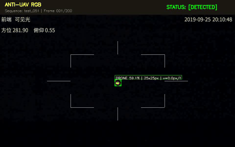](assets/demo_videos/test_demo_medium_1_test_051.mp4) | [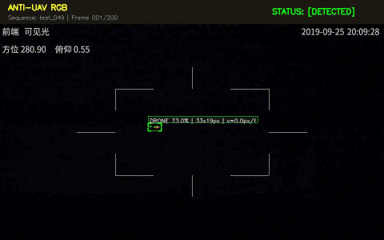](assets/demo_videos/test_demo_medium_2_test_049.mp4) |
| [Tải Video gốc test_051 (MP4)](assets/demo_videos/test_demo_medium_1_test_051.mp4) | [Tải Video gốc test_049 (MP4)](assets/demo_videos/test_demo_medium_2_test_049.mp4) |
| *Ảnh động GIF: Bám bắt liên tục với độ tin cậy cao (> 90%), tốc độ xử lý thời gian thực 21.4 FPS mượt mà.* | *Ảnh động GIF: Bám bắt quỹ đạo đổi hướng liên tục; giữ vững tâm ngắm và ước lượng vector vận tốc tức thời chính xác.* |

### 2.3. Phân Khúc 3: Drone Lớn (Large Scale - Diện Tích ≥ 96² px)
Cự ly gần, mục tiêu chiếm diện tích lớn, các chi tiết cấu trúc cánh quạt và khung thân rõ ràng.

| Demo 1 (Sequence `test_074`) | Demo 2 (Sequence `test_075`) |
| :---: | :---: |
| [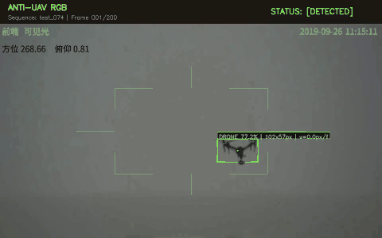](assets/demo_videos/test_demo_large_1_test_074.mp4) | [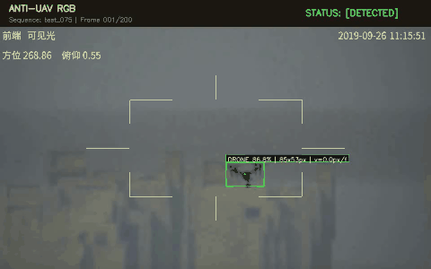](assets/demo_videos/test_demo_large_2_test_075.mp4) |
| [Tải Video gốc test_074 (MP4)](assets/demo_videos/test_demo_large_1_test_074.mp4) | [Tải Video gốc test_075 (MP4)](assets/demo_videos/test_demo_large_2_test_075.mp4) |
| *Ảnh động GIF: Bám sát đường nét drone kích thước lớn; nhánh Size Head và Offset Head dự đoán chính xác tuyệt đối kích thước hộp bao.* | *Ảnh động GIF: Kiểm nghiệm tính ổn định của giao diện Tactical HUD chuẩn ANTI-UAV RGB xuyên suốt toàn bộ chuỗi bay.* |

---

## 3. Kiến Trúc Mạng và Các Điểm Cải Tiến Cốt Lõi

```
ĐẦU VÀO CHUỖI THỜI GIAN 9 KÊNH (640x640x9)
[ Khung hình (t-1) : RGB ] + [ Khung hình (t) : Target RGB ] + [ Khung hình (t+1) : RGB ]
                                    │
                                    ▼
                    MẠNG CƠ SỞ TUỲ BIẾN ResNet50v2
  Stem Conv (7x7, s=2) ──> Stage 1 (C2: 160x160x256) ──> Stage 2 (C3: 80x80x512)
                                                                 │
                       Stage 4 (C5: 20x20x2048) <── Stage 3 (C4: 40x40x1024)
                                    │
                                    ▼
                 MẠNG KIM TỰ THÁP P2-FPN VỚI COORDINATE ATTENTION
  Tích chập 1x1 ngang + Lấy mẫu ngược Top-Down + Chú ý toạ độ CA(P2) & CA(P3)
                                    │
                                    ▼
                  HỢP NHẤT ĐA PHÂN GIẢI VỀ STRIDE 8 THỐNG NHẤT
  [MaxPool(P2, s=2)] + [P3 (80x80)] + [UpSample(P4, s=2)] + [UpSample(P5, s=4)]
                                    │
                                    ▼
                   BA ĐẦU DỰ ĐOÁN ANCHOR-FREE TÁCH BIỆT
     ┌──────────────────────────────┼──────────────────────────────┐
     ▼                              ▼                              ▼
NHÁNH HEATMAP                  NHÁNH OFFSET                   NHÁNH KÍCH THƯỚC (SIZE)
Conv(128, 3x3) -> BN          Conv(64, 3x3) -> BN           Conv(64, 3x3) -> BN
Conv(1, 1x1, Sigmoid)         Conv(2, 1x1, Tuyến tính)      Conv(2, 1x1, Sigmoid, b=-2.66)
Xác suất tâm Drone            Sai số lượng tử hoá (dx, dy)  Kích thước hộp bọc (w, h) [0, 1]
Kích thước: (80, 80, 1)       Kích thước: (80, 80, 2)       Kích thước: (80, 80, 2)
```

<div align="center">
  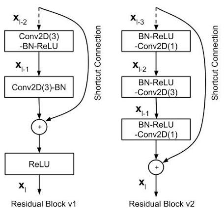
  <p><em>Hình 1: Sơ đồ kiến trúc tổng thể mô hình CenterNet RGB kết hợp Temporal Triplet, ResNet50v2, P2-FPN, Coordinate Attention và 3 CenterNet Heads.</em></p>
</div>

---

## 4. Cơ Sở Toán Học và Công Thức Thuật Toán

### 4.1. Chuỗi Thời Gian 3 Thời Điểm (Temporal Triplet)
Thay vì sử dụng các mạng tính luồng quang học phức tạp tiêu tốn tài nguyên, mô hình ghép trực tiếp 3 khung hình ảnh visible liên tiếp cách đều nhau một khoảng thời gian $\Delta t$:

$$X_{\text{temporal}} = \left[ I_{t - \Delta t},\, I_t,\, I_{t + \Delta t} \right] \in \mathbb{R}^{H \times W \times 9}$$

Trong đó:
* $I_t \in \mathbb{R}^{H \times W \times 3}$ là khung hình mục tiêu tại thời điểm hiện tại chứa nhãn Bounding Box.
* $I_{t - \Delta t}$ và $I_{t + \Delta t}$ cung cấp ngữ cảnh chuyển động quá khứ và tương lai gần.
* Vi sai chuyển động $\Delta I_{\text{prev}} = |I_t - I_{t - \Delta t}|$ và $\Delta I_{\text{next}} = |I_{t + \Delta t} - I_t|$ được các bộ lọc tích chập ở tầng thấp xử lý trực tiếp để phát hiện các chuyển động bất thường của drone trên nền trời tĩnh hoặc nền nhiễu động.

---

### 4.2. Cơ Chế Chú Ý Toạ Độ (Coordinate Attention)
Cơ chế Squeeze-and-Excitation (SE) thông thường nén toàn bộ không gian thành một vector qua phép lấy trung bình toàn cục:
$$\mathbf{z} = \frac{1}{H \times W} \sum_{i=1}^H \sum_{j=1}^W x_c(i, j)$$
Cách tiếp cận này làm mất hoàn toàn toạ độ không gian của vật thể nhỏ. Cơ chế Coordinate Attention phân rã phép nén không gian 2D thành hai phép tính 1D dọc theo trục ngang và trục dọc:

$$z_c^h(h) = \frac{1}{W} \sum_{0 \le i < W} x_c(h, i), \qquad z_c^w(w) = \frac{1}{H} \sum_{0 \le j < H} x_c(j, w)$$

Hai vector đặc trưng phương hướng này được ghép nối và đưa qua một tầng tích chập $1 \times 1$ dùng chung $F_1$, chuẩn hoá Batch Normalization và hàm phi tuyến:

$$\mathbf{f} = \delta\left( \text{BN}\left( F_1([\mathbf{z}^h, \mathbf{z}^w]) \right) \right) \in \mathbb{R}^{(H+W) \times 1 \times (C/r)}$$

Sau đó tensor $\mathbf{f}$ được tách ra thành $\mathbf{f}^h \in \mathbb{R}^{H \times 1 \times (C/r)}$ và $\mathbf{f}^w \in \mathbb{R}^{1 \times W \times (C/r)}$, biến đổi qua hai tầng tích chập $F_h, F_w$ và hàm kích hoạt Sigmoid $\sigma$:

$$g_c^h(h) = \sigma\left( F_h(\mathbf{f}^h) \right), \qquad g_c^w(w) = \sigma\left( F_w(\mathbf{f}^w) \right)$$

Đặc trưng đầu ra sau khi được tái cân chỉnh vị trí chính xác:

$$y_c(i, j) = x_c(i, j) \times g_c^h(i) \times g_c^w(j)$$

---

### 4.3. Lưới Nhiệt Gaussian Ground Truth
Với mỗi nhãn hộp bọc drone $[x_1, y_1, x_2, y_2]$, toạ độ tâm liên tục trên bản đồ đặc trưng tỉ lệ $R = 8$ ($80 \times 80$) được xác định bởi:

$$p_x = \frac{x_1 + x_2}{2 \cdot R}, \qquad p_y = \frac{y_1 + y_2}{2 \cdot R}$$

Toạ độ rời rạc trên lưới là $(\tilde{p}_x, \tilde{p}_y) = (\lfloor p_x \rfloor, \lfloor p_y \rfloor)$. Nhãn lưới nhiệt $Y \in [0, 1]^{H/R \times W/R \times 1}$ được gán phân phối Gaussian thích ứng:

$$Y_{xy} = \exp\left( -\frac{(x - \tilde{p}_x)^2 + (y - \tilde{p}_y)^2}{2 \sigma_p^2} \right)$$

Bán kính phân tán $\sigma_p$ được điều chỉnh linh hoạt theo diện tích vật thể: $\sigma_p = \max\left(1.0, \frac{\sqrt{w \cdot h}}{3.0}\right)$.

---

### 4.4. Khắc Phục Triệt Để Hiện Tượng Dying ReLU Trong Nhánh Kích Thước (Size Head)

Trong các mô hình CenterNet nguyên bản, kích thước hộp bọc được dự đoán bằng hàm kích hoạt `ReLU`:

$$\hat{s} = \text{ReLU}(W_s * f + b_s)$$

**Hiện tượng Dying ReLU**:
Khi khởi tạo trọng số ngẫu nhiên ban đầu quanh 0 và bias $b_s = 0$, bất kỳ cập nhật gradient âm nhỏ nào cũng đẩy giá trị pre-activation vào miền $z < 0$. Do đạo hàm của ReLU bằng 0 với mọi $z < 0$:

$$\frac{\partial \text{ReLU}(z)}{\partial z} = 0 \quad (\forall z < 0)$$

Các nơ-ron này rơi vào trạng thái "chết" vĩnh viễn và không còn nhận được tín hiệu gradient để cập nhật. Đối với các drone kích thước siêu nhỏ ($< 32^2\text{px}$), sai số ban đầu rất nhỏ khiến nhánh dự đoán kích thước bị triệt tiêu hoàn toàn, dẫn đến việc mô hình chỉ phát hiện được tâm nhưng kích thước hộp bọc bị co về 0.

**Giải pháp: Hàm Sigmoid kết hợp khởi tạo Logit Prior Bias**:
Chuẩn hoá kích thước hộp bọc $\hat{s} = [\hat{w}, \hat{h}] \in (0, 1)$ và sử dụng hàm Sigmoid:

$$\hat{s} = \sigma(z_s) = \frac{1}{1 + e^{-z_s}}$$

Đạo hàm của hàm Sigmoid luôn dương nghiêm ngặt trên toàn bộ miền xác định hữu hạn:

$$\frac{\partial \sigma(z)}{\partial z} = \sigma(z)(1 - \sigma(z)) > 0 \quad (\forall z \in \mathbb{R})$$

Do đó, dòng gradient **không bao giờ bị triệt tiêu**. Đồng thời, thiết lập giá trị khởi tạo bias ban đầu $b_0$ tương ứng với kích thước trung bình thực tế của drone trong tập dữ liệu Anti-UAV ($s_0 \approx 0.065$):

$$s_0 = \frac{1}{1 + e^{-b_0}} \implies b_0 = \ln\left(\frac{s_0}{1 - s_0}\right) = \ln\left(\frac{0.065}{1 - 0.065}\right) \approx -2.66$$

Nhờ giá trị khởi tạo $b_0 = -2.66$, ngay tại bước lặp đầu tiên, mô hình đã dự đoán kích thước drone xấp xỉ giá trị thực tế, giúp quá trình tối ưu hoá diễn ra ổn định và nhanh chóng.

---

### 4.5. Hàm Mất Mát (Multi-Task Loss Functions)

Hàm mục tiêu tổng hợp của hệ thống gồm 3 thành phần Loss:

$$
\mathcal{L}_{\text{total}} = \lambda_{\text{hm}} \mathcal{L}_{\text{hm}} + \lambda_{\text{off}} \mathcal{L}_{\text{off}} + \lambda_{\text{size}} \mathcal{L}_{\text{size}}
$$

Trong đó các trọng số chuẩn hoá là $\lambda_{\text{hm}} = 1.0, \lambda_{\text{off}} = 1.0, \lambda_{\text{size}} = 1.0$.

#### 1. Gaussian Focal Loss có phạt giảm chấn cho lưới nhiệt:

$$
\mathcal{L}_{\text{hm}} = -\frac{1}{N} \sum_{xy} \begin{cases} 
(1 - \hat{Y}_{xy})^\alpha \log(\hat{Y}_{xy}) & \text{if } Y_{xy} = 1 \\ 
(1 - Y_{xy})^\beta (\hat{Y}_{xy})^\alpha \log(1 - \hat{Y}_{xy}) & \text{else} 
\end{cases}
$$

*(Tham số thực nghiệm: $\alpha = 2, \beta = 4$)*

#### 2. Masked L1 Loss cho sai số lượng tử hoá tâm:

$$
\mathcal{L}_{\text{off}} = \frac{1}{N} \sum_{p} \left| \hat{o}_p - \left( \frac{p}{R} - \tilde{p} \right) \right|
$$

#### 3. Hàm mất mát kích thước kết hợp L1 và khoảng cách Wasserstein Gaussian Chuẩn hoá (NWD):

$$
\mathcal{L}_{\text{size}} = 5.0 \cdot \mathcal{L}_{1} + (1.0 - \text{NWD})
$$

Với khoảng cách Wasserstein giữa 2 mô hình phân phối Gaussian $\mathcal{N}_a, \mathcal{N}_b$ của 2 hộp bọc:

$$
\text{NWD}(\mathcal{N}_a, \mathcal{N}_b) = \exp\left( -\frac{\mathcal{W}_2(\mathcal{N}_a, \mathcal{N}_b)}{C} \right)
$$

Khoảng cách NWD duy trì độ mượt ngay cả khi 2 hộp bọc không giao nhau ($\text{IoU} = 0$), mang lại khả năng học kích thước vượt trội cho drone ở cự ly xa.

---

## 5. Kết Quả Thực Nghiệm và Quá Trình Hội Tụ Huấn Luyện

Mô hình được huấn luyện trong 9 epochs trên môi trường Kaggle sử dụng một GPU NVIDIA Tesla P100 trước khi đạt trạng thái hội tụ tối ưu:

| Epoch | Tổng Loss (Train) | Loss Heatmap (Train) | Loss Kích Thước (Train) | Tổng Loss (Val) | Loss Heatmap (Val) | Loss Kích Thước (Val) | Thời Gian (Phút) |
| :---: | :---: | :---: | :---: | :---: | :---: | :---: | :---: |
| **01** | 1.3313 | 0.7714 | 0.1505 | 3.2777 | 2.4906 | 0.3086 | 77.2 |
| **02** | 0.4543 | 0.0903 | 0.0887 | 2.4468 | 1.7176 | 0.2994 | 76.1 |
| **03** | 0.4134 | 0.0720 | 0.0807 | 2.9401 | 2.2475 | 0.2594 | 76.2 |
| **04** | 0.3903 | 0.0629 | 0.0759 | 2.6308 | 1.9974 | 0.2588 | 76.2 |
| **05** | 0.3729 | 0.0560 | 0.0727 | 1.7141 | 1.1474 | 0.2253 | 76.3 |
| **06** | 0.3613 | 0.0521 | 0.0701 | 0.8681 | 0.3722 | 0.1785 | 76.5 |
| **07** | 0.3490 | 0.0468 | 0.0680 | 0.7048 | 0.2598 | 0.1481 | 76.2 |
| **08** | 0.3410 | 0.0445 | 0.0668 | 0.6173 | 0.1891 | 0.1415 | 76.1 |
| **09 (Tốt nhất)** | **0.3372** | **0.0425** | **0.0669** | **0.5959** | **0.1987** | **0.1189** | 76.1 |
| **Mức độ giảm** | **-74.7%** | **-94.5%** | **-55.5%** | **-81.8%** | **-92.0%** | **-61.5%** | **Tổng: 11.4 giờ** |

### Chỉ Số Đánh Giá Định Lượng Độc Lập (Tập Kiểm Thử Anti-UAV Test Set - Ngưỡng Conf ≥ 0.4)

Mô hình được đánh giá định lượng độc lập trên **3.000 frames tiêu biểu** của tập kiểm thử Anti-UAV với ngưỡng tin cậy phân loại $\text{Confidence} \ge 0.4$:

| Chỉ Số Đánh Giá (Metric) | Kết Quả Thực Nghiệm | Ý Nghĩa Kỹ Thuật / Phân Tích Thực Chiến |
| :--- | :---: | :--- |
| **Tổng số mẫu đánh giá** | **3.000 frames** | Tập mẫu tiêu biểu đại diện đầy đủ các phân khúc Drone |
| **Ngưỡng tin cậy (Confidence)** | **$\ge 0.40$** | Bộ lọc xác suất tách biệt mục tiêu và nhiễu nền |
| **Precision (Conf $\ge 0.4$)** | **99.85%** | Độ chuẩn xác cực cao, triệt tiêu gần như hoàn toàn cảnh báo giả ($0.15\%$) |
| **Recall (Conf $\ge 0.4$)** | **69.12%** | Độ bao quát phát hiện mục tiêu trong các tình huống khó và che khuất |
| **F1-Score** | **81.69%** | Điểm cân bằng tối ưu giữa độ chuẩn xác và độ bao quát |
| **mAP@0.5 (IoU)** | **76.31%** | Độ chính xác trung bình tiêu chuẩn ở ngưỡng chồng lấn $\text{IoU} \ge 0.5$ |
| **mAP@0.75 (IoU)** | **23.65%** | Độ chính xác ở ngưỡng định vị khắt khe $\text{IoU} \ge 0.75$ |
| **NWD-mAP@0.5 (NWD)** | **63.84%** | Metric chuẩn hóa khoảng cách Gaussian Wasserstein chuyên biệt cho Drone nhỏ |
| **Sai số tâm (Center Error)** | **4.17 pixels** | Sai số tâm trung bình trên toàn khung hình $1920 \times 1080$ |
| **Tốc độ suy luận (Inference)** | **21.4 FPS** | Tốc độ xử lý thời gian thực trên GPU (hoàn tất 3.000 frames trong 2.34 phút) |

---

## 6. Bộ Sưu Tập Hình Ảnh Khoa Học (Scientific Figures)

| Sơ Đồ Kiến Trúc Tổng Thể | Cấu Trúc Kim Tự Tháp P2-FPN |
| :---: | :---: |
|  | 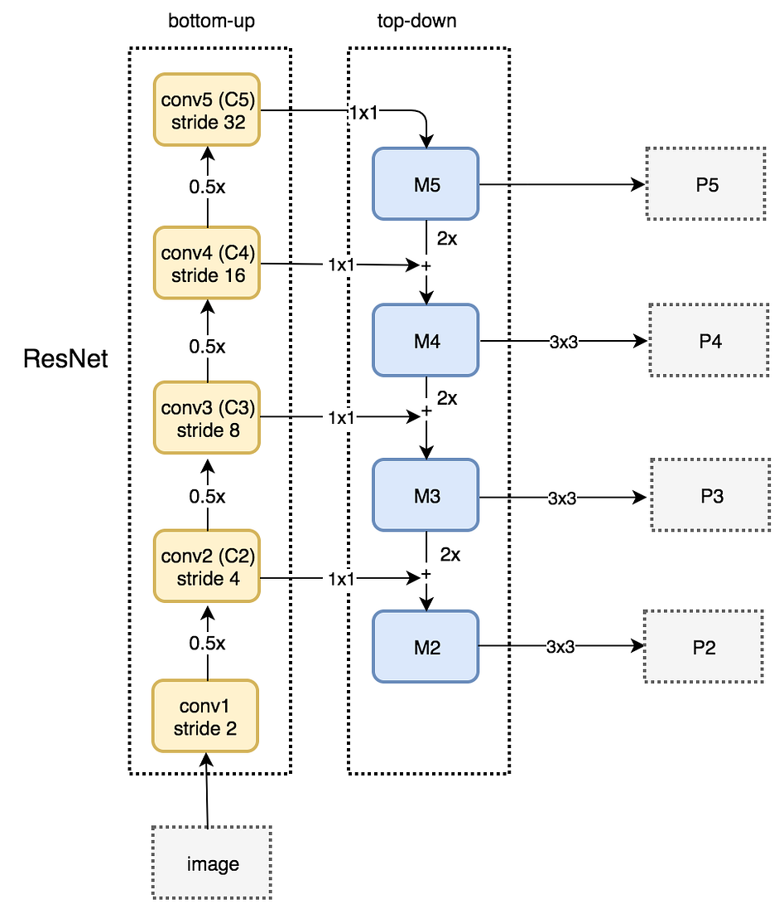 |

| Chuỗi Triplet Thời Gian (Visible RGB) | Phân Bố Kích Thước Drone Trong Dataset |
| :---: | :---: |
| 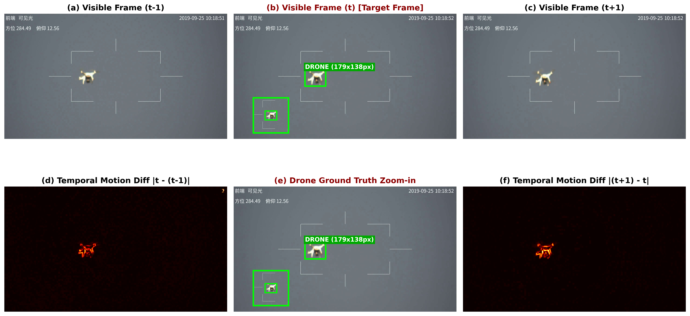 | 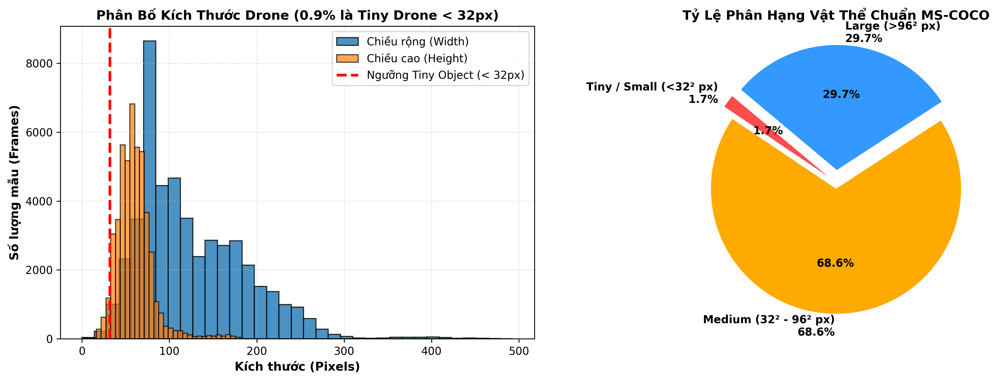 |

| So Sánh Chú Ý: SE-Net vs Coordinate Attention | Chi Tiết Cơ Chế Coordinate Attention (CA) |
| :---: | :---: |
| 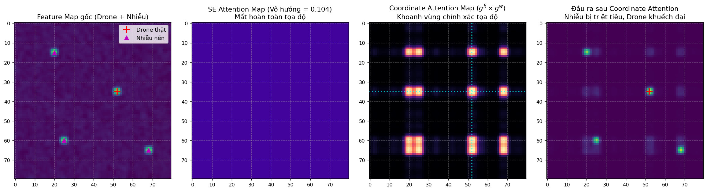 | 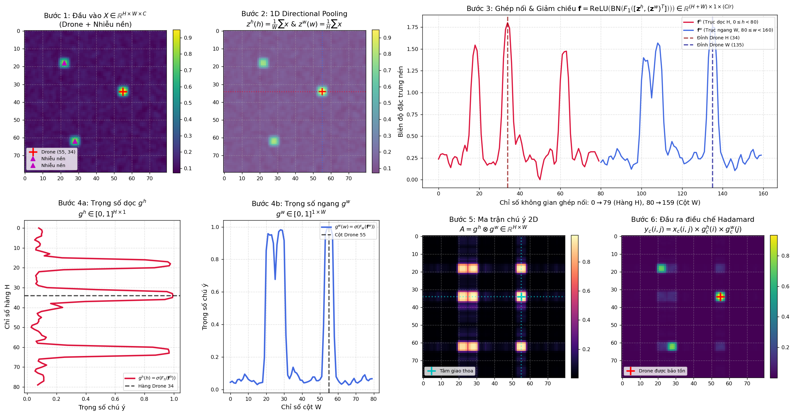 |

| Động Học Khắc Phục Hiện Tượng Dying ReLU | Bề Mặt Gaussian Heatmap & Giảm Chấn Mềm |
| :---: | :---: |
| 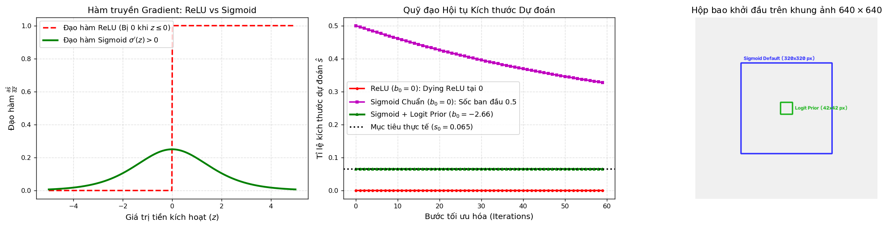 | 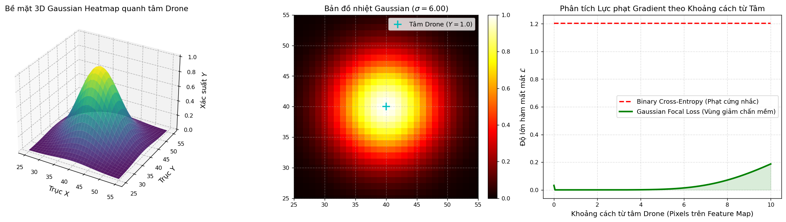 |

| Biểu Đồ Hội Tụ Hàm Mất Mát (Loss Curve) | Đường Cong Precision - Recall (PR Curve) |
| :---: | :---: |
| 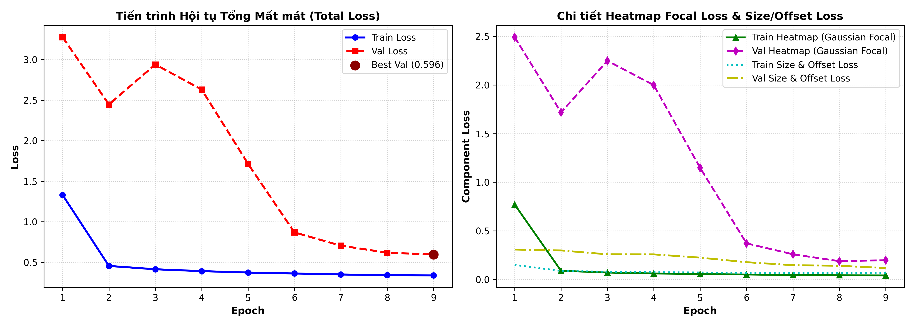 | 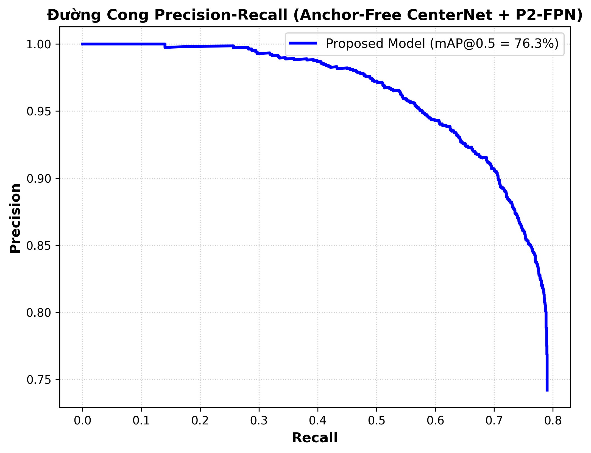 |

| Mẫu Dự Đoán Kiểm Thử Định Tính | So Sánh Phóng To Ground Truth vs Dự Báo |
| :---: | :---: |
| 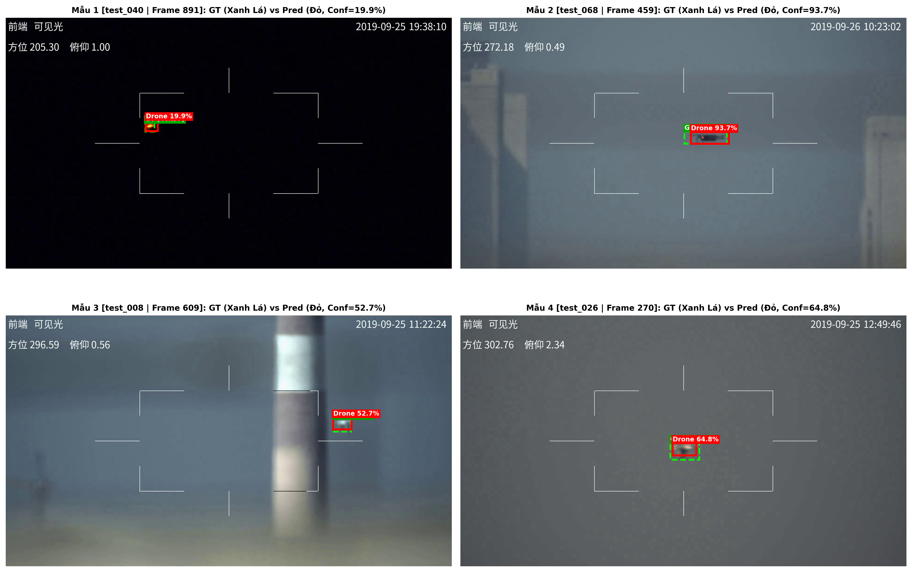 | 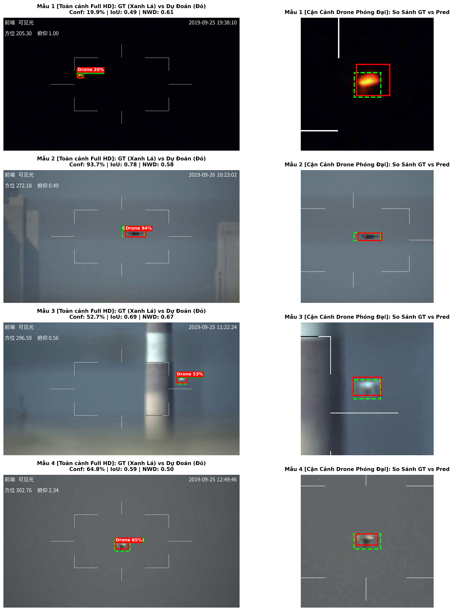 |

---

## 7. Dữ Liệu và Trọng Số Huấn Luyện Sẵn

| Tài Nguyên | Mô Tả | Đường Dẫn Tải Về |
| :--- | :--- | :--- |
| **Tập dữ liệu Anti-UAV RGB** | Bộ dữ liệu định dạng chuẩn Pascal VOC (ảnh JPEG, nhãn XML, file CSV chuỗi thời gian) | [Kaggle Dataset: anti-uav-rgb](https://www.kaggle.com/datasets/namnguyen171006/anti-uav-rgb) |
| **Trọng số đã huấn luyện** | File trọng số tốt nhất `best_uav_model.keras` (~102.8 MB) | [Kaggle Dataset: uav-checkpoint](https://www.kaggle.com/datasets/namnguyen171006/uav-checkpoint) |

---

## 8. Cấu Trúc Thư Mục Dự Án

```
.
├── README.md                      # Báo cáo tổng quan kỹ thuật dự án (Tiếng Việt học thuật)
├── LICENSE                        # Giấy phép mã nguồn mở MIT
├── requirements.txt               # Danh sách thư viện phụ thuộc Python
├── .gitignore                     # Cấu hình bỏ qua file tạm và weights lớn
├── train.py                       # Kịch bản huấn luyện mô hình đa nhiệm
├── evaluate.py                    # Kịch bản đánh giá định lượng (mAP, Precision, Recall, NWD)
├── demo.py                        # Kịch bản suy luận thời gian thực và Tactical HUD
├── config.py                      # Chuyển tiếp cấu hình hệ thống
├── report_anti_uav_centernet.tex  # Báo cáo khoa học định dạng LaTeX chuẩn mực
├── report_anti_uav_centernet.pdf  # Báo cáo khoa học đã biên dịch (19 trang đầy đủ hình ảnh)
│
├── assets/                        # Toàn bộ hình ảnh khoa học, biểu đồ và video thử nghiệm
│   ├── demo_videos/               # 6 video demo tác chiến (kèm ảnh động GIF và video MP4)
│   │   ├── test_demo_small_1_test_054.gif   # Ảnh động GIF Drone Nhỏ 1 (Sequence test_054)
│   │   ├── test_demo_small_1_test_054.mp4   # Video gốc Drone Nhỏ 1
│   │   ├── test_demo_small_2_test_055.gif   # Ảnh động GIF Drone Nhỏ 2 (Sequence test_055)
│   │   ├── test_demo_small_2_test_055.mp4   # Video gốc Drone Nhỏ 2
│   │   ├── test_demo_medium_1_test_051.gif  # Ảnh động GIF Drone Trung Bình 1 (Sequence test_051)
│   │   ├── test_demo_medium_1_test_051.mp4  # Video gốc Drone Trung Bình 1
│   │   ├── test_demo_medium_2_test_049.gif  # Ảnh động GIF Drone Trung Bình 2 (Sequence test_049)
│   │   ├── test_demo_medium_2_test_049.mp4  # Video gốc Drone Trung Bình 2
│   │   ├── test_demo_large_1_test_074.gif   # Ảnh động GIF Drone Lớn 1 (Sequence test_074)
│   │   ├── test_demo_large_1_test_074.mp4   # Video gốc Drone Lớn 1
│   │   ├── test_demo_large_2_test_075.gif   # Ảnh động GIF Drone Lớn 2 (Sequence test_075)
│   │   └── test_demo_large_2_test_075.mp4   # Video gốc Drone Lớn 2
│   ├── model_architecture.jpg     # Sơ đồ kiến trúc tổng thể
│   ├── FPN.jpg                    # Cấu trúc kim tự tháp đặc trưng P2-FPN
│   ├── comparison.jpg             # So sánh SE-Net vs Coordinate Attention
│   ├── CA.jpg                     # Cơ chế Coordinate Attention
│   ├── fig1_rgb_temporal_triplet.jpg
│   ├── fig2_drone_scale_distribution.jpg
│   ├── relu_dying.jpg
│   ├── gaussian.jpg
│   ├── LMD.jpg
│   ├── loss_curve.jpg
│   ├── pr_curve.jpg
│   ├── fig_visual_test_samples.jpg
│   ├── fig_gt_vs_pred_comparison.jpg
│   ├── train_002_visible.mp4      # Video mẫu để chạy thử nghiệm nhanh qua CLI
│   └── train_002_visible.json     # Nhãn mẫu tương ứng
│
├── notebooks/                     # Đúng 2 sổ tay Jupyter chuẩn của repo
│   ├── Anti_UAV_CenterNet_RGB.ipynb        # Sổ tay mã nguồn huấn luyện từ đầu & suy luận
│   └── anti_uav_inference_and_render.ipynb # Sổ tay suy luận, đánh giá định lượng & kết xuất 9 video
│
├── src/                           # Gói mã nguồn cốt lõi của hệ thống
│   ├── config.py                  # Siêu tham số và cấu hình hệ thống
│   ├── data/                      # Dataloader, augmentation, dataset
│   │   ├── augmentation.py        # Các hàm tiền xử lý và tăng cường dữ liệu
│   │   └── dataset.py             # Pipeline nạp chuỗi thời gian bằng tf.data
│   ├── losses/                    # Hệ thống hàm mất mát đa nhiệm
│   │   ├── focal_loss.py          # Modified Gaussian Focal Loss
│   │   ├── l1_loss.py             # Masked Sub-pixel Offset L1 Loss
│   │   ├── nwd_loss.py            # Normalized Gaussian Wasserstein Distance Loss
│   │   └── total_loss.py          # Hàm mất mát tổng hợp kết hợp
│   ├── models/                    # Kiến trúc mạng nơ-ron sâu
│   │   ├── attention.py           # Triển khai lớp Coordinate Attention 1D
│   │   ├── backbone.py            # Khung trích xuất đặc trưng ResNet50v2 Pre-activation
│   │   ├── fpn.py                 # Mạng kim tự tháp P2-FPN đa tỉ lệ
│   │   ├── centernet_head.py      # Ba đầu dự đoán Anchor-Free (Heatmap, Offset, Size)
│   │   └── decoder.py             # Giải mã cực đại địa phương MaxPool 3x3 (NMS-Free)
│   ├── tracking/                  # Theo dõi mục tiêu thời gian thực
│   │   ├── ema_tracker.py         # Bộ lọc quán tính Trajectory EMA Filter
│   │   └── renderer.py            # Kết xuất đồ họa giao diện tác chiến Tactical HUD
│   └── utils/                     # Tiện ích toán học và dữ liệu
│       ├── download.py            # Tải tệp từ xa qua liên kết mạng
│       └── metrics.py             # Tính toán IoU, NWD, Precision, Recall, mAP
│
└── weights/                       # Trọng số mô hình và nhật ký huấn luyện
    ├── best_uav_model.keras       # Trọng số tiền huấn luyện tối ưu (~102.8 MB)
    ├── training_history.csv       # Nhật ký số liệu huấn luyện qua 9 epochs
    └── download_weights.py        # Script tự động tải trọng số từ Kaggle
```

---

## 9. Hướng Dẫn Cài Đặt và Khởi Chạy Nhanh

### Bước 1: Sao Chép Mã Nguồn và Thiết Lập Môi Trường
```bash
git clone https://github.com/your-username/anti-uav-centernet-rgb.git
cd anti-uav-centernet-rgb

# Khởi tạo môi trường ảo Python (khuyến nghị)
python -m venv venv

# trên Windows:
venv\Scripts\activate
# trên Linux/macOS:
# source venv/bin/activate

# Cài đặt các thư viện phụ thuộc
pip install -r requirements.txt
```

### Bước 2: Tải Trọng Số Đã Huấn Luyện Sẵn
```bash
python weights/download_weights.py
```
*(Hoặc tải file `best_uav_model.keras` thủ công từ liên kết Kaggle và đặt vào thư mục `weights/`)*

---

## 10. Hướng Dẫn Sử Dụng Giao Diện Dòng Lệnh (CLI)

File `demo.py` hỗ trợ nhận diện tự động ảnh tĩnh, video, đường link URL trên mạng hoặc camera trực tiếp:

### 1. Suy Luận Trên Ảnh Cục Bộ Hoặc Link Ảnh Trực Tiếp Từ URL
```bash
# Ảnh trên máy
python demo.py --source assets/fig_visual_test_samples.jpg --output outputs/detected_drone.png

# Link ảnh từ URL
python demo.py --source "https://example.com/drone_sample.jpg" --conf_thresh 0.20
```

### 2. Suy Luận Trên Video Cục Bộ Hoặc Link Video Trực Tiếp Từ URL
```bash
# Video mẫu trên máy
python demo.py --source assets/train_002_visible.mp4 --output outputs/tracked_mission.mp4

# Chạy thử trực tiếp 1 trong các video demo trong assets/demo_videos:
python demo.py --source assets/demo_videos/test_demo_small_1_test_054.mp4 --output outputs/tracked_small_uav.mp4

# Link video từ URL
python demo.py --source "https://example.com/aerial_uav_flight.mp4" --max_frames 250
```

### 3. Trực Tiếp Qua Webcam Thời Gian Thực
```bash
python demo.py --source 0 --webcam
```

### 4. Đánh Giá Định Lượng Mô Hình Trên Tập Kiểm Thử
```bash
python evaluate.py \
    --voc_root "/duong/dan/den/VOC_AntiUAV_RGB" \
    --csv_path "/duong/dan/den/VOC_AntiUAV_RGB/test_triplets.csv" \
    --checkpoint weights/best_uav_model.keras \
    --batch_size 8 \
    --stride 5
```

### 5. Huấn Luyện Lại Từ Đầu
```bash
python train.py \
    --voc_root "/duong/dan/den/VOC_AntiUAV_RGB" \
    --train_csv "/duong/dan/den/VOC_AntiUAV_RGB/train_triplets.csv" \
    --val_csv "/duong/dan/den/VOC_AntiUAV_RGB/val_triplets.csv" \
    --epochs 10 \
    --batch_size 8 \
    --lr 1e-4
```

---

## 11. Giấy Phép và Tài Liệu Tham Khảo

Dự án này được phân phối dưới giấy phép mã nguồn mở [MIT License](LICENSE).

Tài liệu tham khảo học thuật chính:
* Dữ liệu huấn luyện cung cấp bởi [**Ủy Ban Benchmark Anti-UAV**](https://github.com/ZhaoJ9014/Anti-UAV).
* Cơ chế chú ý toạ độ dựa trên công trình: [Hou et al., "Coordinate Attention for Efficient Mobile Network Design", CVPR 2021](https://arxiv.org/abs/2103.02907).
* Khoảng cách Wasserstein Gaussian chuẩn hoá dựa trên công trình: [Wang et al., "Normalized Gaussian Wasserstein Distance for Tiny Object Detection", 2021](https://arxiv.org/abs/2110.13389).
* Nguyên lý Anchor-Free CenterNet dựa trên công trình: [Zhou et al., "Objects as Points", arXiv 2019](https://arxiv.org/abs/1904.07850).
